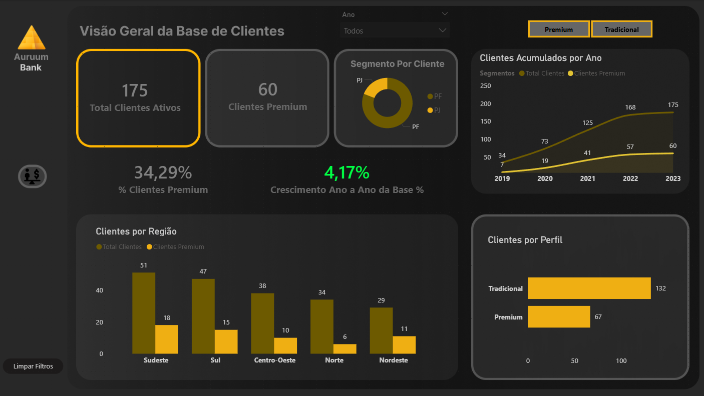
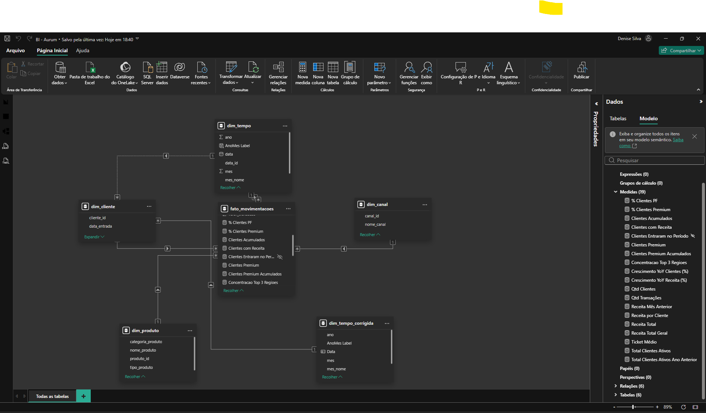
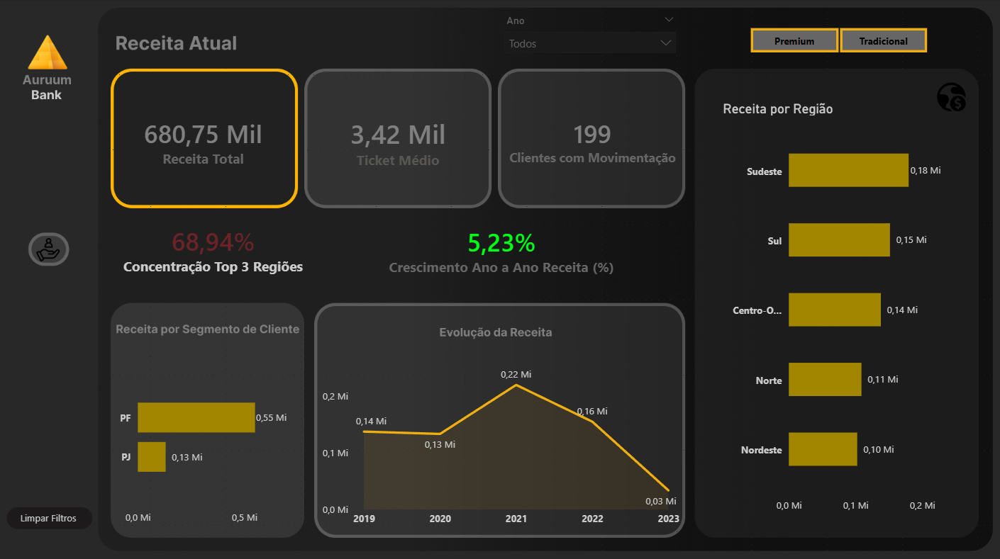

# 🏦 Banco Auruum — Análise de Clientes (SQL & Power BI)

## 📌 Contexto do Negócio
O Banco Auruum encontra-se em fase de crescimento e possui uma base relevante de clientes distribuídos por diferentes regiões do país, com perfis variados (**PF / PJ** e **Premium / Tradicional**).

Apesar do volume de dados disponível, a diretoria não possuía uma visão clara, estruturada e confiável sobre a composição dessa base, o que dificultava a tomada de decisões estratégicas orientadas por dados.  
As análises existentes eram **pontuais, reativas** e **sem padronização de métricas** ou visão consolidada.

---

## 🚨 Problema de Negócio
A empresa enfrentava dificuldades para responder, com segurança, a perguntas-chave como:

- Onde estão concentrados os clientes Premium ativos?
- Quais regiões apresentam maior potencial de crescimento?
- A base de clientes Premium está crescendo, estável ou em queda ao longo do tempo?
- Qual é o perfil predominante da base atual (PF x PJ)?

A ausência dessas respostas impactava diretamente:
- o direcionamento de ações comerciais  
- a definição de prioridades regionais  
- o planejamento estratégico de médio e longo prazo  

---

## 🧾 Solicitação da Área de Negócios
Diante desse cenário, a área de negócios solicitou apoio ao time de dados com o seguinte objetivo:

> *“Precisamos de uma análise que traga visibilidade clara sobre nossa base de clientes, com foco em segmentação por perfil e região, e que nos ajude a identificar onde estão nossas melhores oportunidades.”*

---

## 🎯 Objetivo do Projeto
Estruturar uma **análise analítica e exploratória** da base de clientes, utilizando **SQL e Power BI**, com métricas bem definidas, confiáveis e reutilizáveis, capazes de apoiar decisões estratégicas e o acompanhamento contínuo da base.

---

## 📊 Entregas do Projeto

### 1️⃣ Métricas da Base de Clientes
- Total de clientes ativos  
- Distribuição por perfil (PF / PJ)  
- Distribuição por categoria (Premium / Tradicional)  
- Percentual de clientes Premium  

### 2️⃣ Análise Regional
- Clientes ativos por região  
- Clientes Premium por região  
- Concentração da receita nas principais regiões  

### 3️⃣ Visão Temporal
- Evolução da base de clientes ao longo do tempo  
- Crescimento ano a ano (YoY) de clientes  
- Crescimento ano a ano (YoY) de receita  

### 4️⃣ Insights Analíticos
- Identificação de regiões com maior concentração de valor  
- Tendências de crescimento ou estagnação da base  
- Apoio à priorização comercial e estratégica  

---

## 🧠 Abordagem Analítica
Este projeto foi desenvolvido a partir de uma **análise descritiva e diagnóstica**, com foco em compreender a composição da base de clientes, identificar padrões de distribuição e apoiar decisões estratégicas iniciais da diretoria.

Essa abordagem foi escolhida porque o banco ainda não possuía:
- métricas padronizadas  
- visão consolidada da base  
- histórico analítico suficientemente maduro para modelos avançados  

Antes de avançar para análises preditivas ou prescritivas, foi fundamental **estruturar, compreender e validar os dados existentes**, garantindo consistência, governança e alinhamento com o negócio.

---

## ❓ Por que essa abordagem e não outra?
Outras abordagens analíticas foram consideradas, porém:

- **Análise preditiva** não foi aplicada por exigir uma base histórica mais madura e objetivos futuros bem definidos.  
- **Análise prescritiva** depende de modelos preditivos consolidados, o que não condizia com o estágio atual do banco.  
- **Machine Learning** não agregaria valor neste momento sem uma compreensão clara da base e dos padrões existentes.  

Dessa forma, a análise descritiva e diagnóstica se mostrou a mais adequada para responder às principais perguntas do negócio com clareza, confiabilidade e rapidez.

---

## 🔁 Reaplicabilidade da Abordagem
Embora o contexto seja bancário, a abordagem utilizada neste projeto é aplicável a diversos cenários, como:

- **Varejo e e-commerce** — segmentação e evolução da base de clientes  
- **Telecom** — clientes ativos por região e plano  
- **SaaS** — distribuição de clientes por perfil e crescimento ao longo do tempo  
- **Educação e saúde** — análise de usuários ou pacientes  

Sempre que o objetivo for **entender a composição, distribuição e evolução de uma base**, essa abordagem se mostra eficaz.

---

## 🖥️ Visualização do Dashboard
A seguir, algumas visualizações do dashboard desenvolvido no Power BI, com foco em apoiar decisões estratégicas relacionadas à base de clientes e à performance do banco.

### 📊 Visão Geral da Base de Clientes
Visão consolidada da base de clientes ativos, com segmentação por perfil (PF / PJ), categoria (Premium / Tradicional), distribuição regional e evolução ao longo do tempo.

---

### 🧩 Modelo de Dados
Modelo analítico estruturado em **esquema estrela**, garantindo consistência, governança e flexibilidade para análises temporais, regionais e por perfil de cliente.

---

### 💰 Receita e Performance Financeira
Análise da receita total, ticket médio, concentração regional e evolução da receita ao longo do tempo, apoiando decisões financeiras e comerciais.

---

## 📚 Conhecimentos Aplicados no Projeto
- **SQL** — criação de views analíticas, agregações, filtros e consolidação da base  
- **Power BI** — modelagem analítica, criação de KPIs, DAX e dashboards interativos  
- **Modelagem de Dados** — organização das tabelas com foco em negócio e governança analítica  
- **Análise de Negócio** — tradução de perguntas estratégicas em métricas acionáveis  

A lógica analítica e as medidas DAX estão documentadas em:  
📄 `METRICAS_DAX.md`

Os principais insights de negócio estão registrados em:  
📄 `INSIGHTS_ANALISE.md`

---

## ⚠️ Limitações e Próximos Passos

### Limitações atuais
- Análise focada apenas em clientes ativos  
- Ausência de variáveis comportamentais ou transacionais mais detalhadas  
- Não utilização de modelos preditivos  

### Próximos passos possíveis
- Inclusão de dados de churn  
- Análises preditivas de crescimento ou evasão  
- Segmentações mais avançadas por comportamento e valor  

---

## 🛠️ Tecnologias Utilizadas
- SQL  
- Power BI  
- Modelagem de Dados Analítica  

---

## 📂 Estrutura do Repositório
- `sql/` — scripts SQL e views analíticas  
- `METRICAS_DAX.md` — documentação das métricas, KPIs e lógica analítica  
- `INSIGHTS_ANALISE.md` — insights de negócio extraídos da análise  
- `images/` — imagens e screenshots do dashboard  
- `README.md` — contextualização do projeto  
